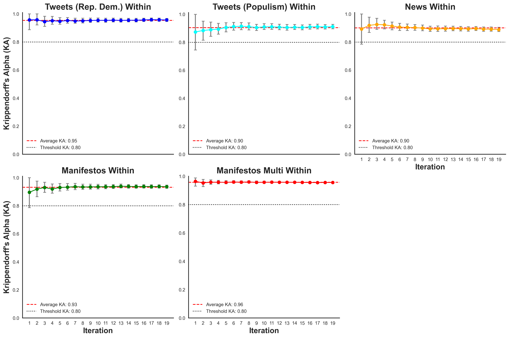
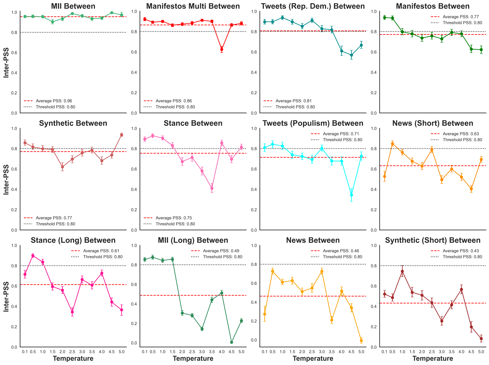

# promptstability
Repo for paper analyzing stability of outcomes resulting from variations in language model prompt specification.

## Usage

To run all scripts:

```bash
python 00_master.py

```

### Define your custom annotation function

#### OpenAI example
```
import OpenAI

client = OpenAI(
    api_key = get_openai_api_key()
)

# The annotation function should take the text, the prompt, and temperature as its three parameters.
def annotate(text, prompt, temperature=0.1): 
    try:
        response = client.chat.completions.create(
            model='gpt-3-5-turbo',
            temperature=temperature,
            messages=[
                {"role": "system", "content": prompt}, 
                {"role": "user", "content": text}
            ]
        )
    except Exception as e:
        print(f"Caught exception: {e}")
        raise e

    return ''.join(choice.message.content for choice in response.choices)
```

#### Ollama example
```    
import ollama
MODEL = 'llama3'
def annotate(text, prompt, temperature=0.1):
    response = ollama.chat(model=MODEL, messages=[
        {"role": "system", "content": f"'{prompt}'"},  # The system instruction tells the bot how it is supposed to behave
        {"role": "user", "content": f"'{text}'"}  # This provides the text to be analyzed.
    ])
return response['message']['content']
```


### Within prompt

```python
import pandas as pd
from utils import PromptStabilityAnalysis, get_openai_api_key
import matplotlib.pyplot as plt

# Baseline stochasticity

# Data
df = pd.read_csv('data/tweets.csv')
df = df.sample(10, random_state=123)
example_data = list(df['text'].values)

psa = PromptStabilityAnalysis(annotation_function=annotate, data=example_data)

# Step 2: Construct the Prompt
original_text = 'The following is a Twitter message written either by a Republican or a Democrat before the 2020 election. Your task is to guess whether the author is Republican or Democrat.'
prompt_postfix = '[Respond 0 for Democrat, or 1 for Republican. Guess if you do not know. Respond nothing else.]'

# Run baseline_stochasticity
ka_scores, annotated_data = psa.baseline_stochasticity(original_text, prompt_postfix, iterations=20, plot=True, save_path='plots/00_tweets_within.png', save_csv="data/annotated/tweets_within.csv")

```


### Between prompt

```python
# Run interprompt_stochasticity
# Set temperatures
temperatures = [0.1, 0.5, 1.0, 1.5, 2.0, 2.5, 3.0, 3.5, 4.0, 4.5,  5.0]

# Get KA scores across different temperature paraphrasings
ka_scores, annotated_data = psa.interprompt_stochasticity(original_text, prompt_postfix, nr_variations=10, temperatures=temperatures, iterations = 1, print_prompts=True, plot=True, save_path='plots/00_tweets_between.png', save_csv = 'data/annotated/tweets_between.csv')
```

And then to plot all data:

```bash
python 11_plot_all.py
```




# Development package

[](https://pypi.org/project/promptstability/)
[](https://github.com/palaiole13/promptstability/actions/workflows/test.yml)
[](https://github.com/palaiole13/promptstability/releases)
[](https://github.com/palaiole13/promptstability/blob/main/LICENSE)

Package for generating Prompt Stability Scores (PSS). Useful for analysing the stability of outcomes resulting from variations in language model prompt specifications.

## Installation

### TestPypi installation
Install this library using `pip`:
```bash
pip install --index-url https://test.pypi.org/simple/ --extra-index-url https://pypi.org/simple promptstability
```

### Pypi installation (pending upload)
Install this library using `pip`:
```bash
pip install promptstability
```
## Usage

### Define your custom annotation function

#### OpenAI example
``` python
import OpenAI
from promptstability.core import get_openai_api_key


client = OpenAI(
    api_key = get_openai_api_key()
)

# The annotation function should take the text, the prompt, and temperature as its three parameters.
def annotate(text, prompt, temperature=0.1):
    try:
        response = client.chat.completions.create(
            model='gpt-3-5-turbo',
            temperature=temperature,
            messages=[
                {"role": "system", "content": prompt},
                {"role": "user", "content": text}
            ]
        )
    except Exception as e:
        print(f"Caught exception: {e}")
        raise e

    return ''.join(choice.message.content for choice in response.choices)
```

#### Ollama example
``` python
import ollama
MODEL = 'llama3'
def annotate(text, prompt, temperature=0.1):
    response = ollama.chat(model=MODEL, messages=[
        {"role": "system", "content": f"'{prompt}'"},  # The system instruction tells the bot how it is supposed to behave
        {"role": "user", "content": f"'{text}'"}  # This provides the text to be analyzed.
    ])
return response['message']['content']
```


### Prompt Stability Score - Within prompt

```python
import pandas as pd
import matplotlib.pyplot as plt

from promptstability.core import PromptStabilityAnalysis

# Baseline stochasticity

# Data
df = pd.read_csv('data/tweets.csv')
df = df.sample(10, random_state=123)
example_data = list(df['text'].values)

psa = PromptStabilityAnalysis(annotation_function=annotate, data=example_data)

# Step 2: Construct the Prompt
original_text = 'The following is a Twitter message written either by a Republican or a Democrat before the 2020 election. Your task is to guess whether the author is Republican or Democrat.'
prompt_postfix = '[Respond 0 for Democrat, or 1 for Republican. Guess if you do not know. Respond nothing else.]'

# Run baseline_stochasticity (aka within-prompt PSS)
ka_scores, annotated_data = psa.baseline_stochasticity(original_text, prompt_postfix, iterations=20, plot=True, save_path='plots/00_tweets_within.png', save_csv="data/annotated/tweets_within.csv")

```


### Prompt Stability Score - Between prompt

```python
# Run interprompt_stochasticity (aka between-prompt PSS)
# Set temperatures
temperatures = [0.1, 0.5, 1.0, 1.5, 2.0, 2.5, 3.0, 3.5, 4.0, 4.5,  5.0]

# Get KA scores across different temperature paraphrasings
ka_scores, annotated_data = psa.interprompt_stochasticity(original_text, prompt_postfix, nr_variations=10, temperatures=temperatures, iterations = 1, print_prompts=True, plot=True, save_path='plots/00_tweets_between.png', save_csv = 'data/annotated/tweets_between.csv')
```


## Development

To contribute to this library, first checkout the code. Then create a new virtual environment:
```bash
cd promptstability
python -m venv venv
source venv/bin/activate
```
Now install the dependencies and test dependencies:
```bash
pip install -e '.[test]'
```
To run the tests:
```bash
pytest
```
