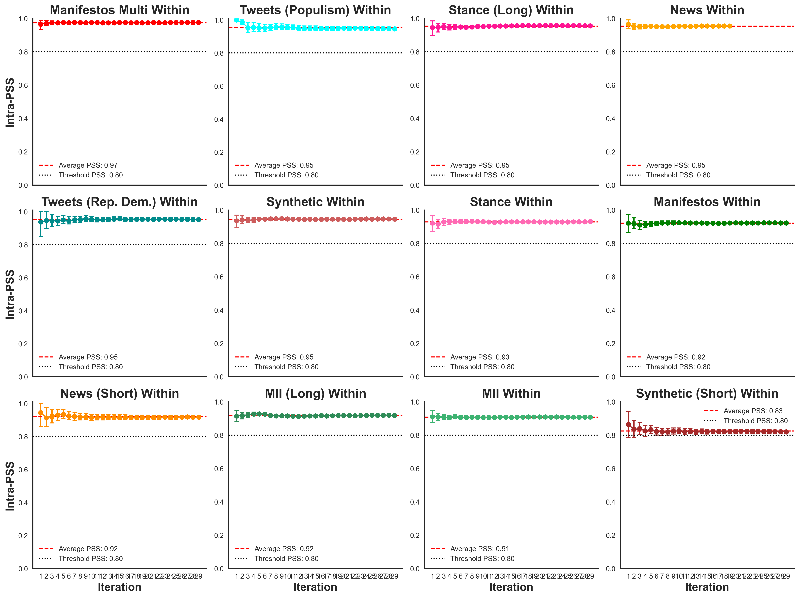
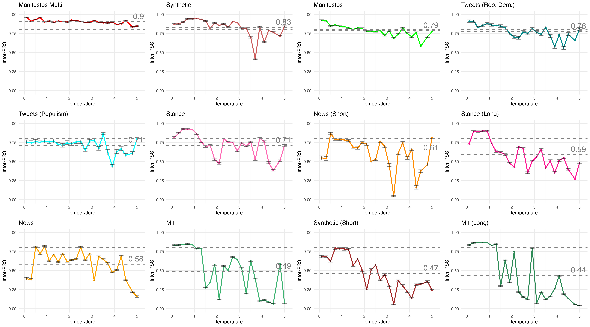

# promptstability
Repo for paper analyzing stability of outcomes resulting from variations in language model prompt specification.

## Usage

To run all scripts:

```bash
python 00_master.py


And to plot all data:

``bash
python 11_plot_all.py
```





# Development package

[](https://pypi.org/project/promptstability/)
[](https://github.com/palaiole13/promptstability/actions/workflows/test.yml)
[](https://github.com/palaiole13/promptstability/releases)
[](https://github.com/palaiole13/promptstability/blob/main/LICENSE)

## Installation

### Pypi installation
Install this library using `pip`:

```bash
pip install promptstability
```

# Example usage

```python
import pandas as pd
import matplotlib.pyplot as plt
from utils import PromptStabilityAnalysis, get_openai_api_key
from openai import OpenAI
import ollama

#############################################
# 1. Load a 5% subsample of the manifestos dataset
#############################################
df = pd.read_csv('data/manifestos.csv')
df = df[df['scale'] == 'Economic']
# Take 5% of the rows (at least 1 row if the dataset is very small)
sample_size = max(1, int(0.1 * len(df)))
df = df.sample(sample_size, random_state=123)
data = list(df['sentence_context'].values)

# Define the prompt texts
original_text = (
    "The text provided is a UK party manifesto. "
    "Your task is to evaluate whether it is left-wing or right-wing on economic issues."
)
prompt_postfix = "Respond with 0 for left-wing or 1 for right-wing."

#############################################
# 2. ANALYSIS USING OPENAI (e.g., GPT-3.5-turbo)
#############################################
# Define the OpenAI annotation function
APIKEY = get_openai_api_key()
OPENAI_MODEL = 'gpt-3.5-turbo'
client = OpenAI(api_key=APIKEY)

def annotate_openai(text, prompt, temperature=0.1):
    try:
        response = client.chat.completions.create(
            model=OPENAI_MODEL,
            temperature=temperature,
            messages=[
                {"role": "system", "content": prompt},
                {"role": "user", "content": text}
            ]
        )
    except Exception as e:
        print(f"OpenAI exception: {e}")
        raise e
    return ''.join(choice.message.content for choice in response.choices)

# Instantiate the analysis class using OpenAI’s annotation function
psa_openai = PromptStabilityAnalysis(annotation_function=annotate_openai, data=data)

# Run intra-prompt (baseline) analysis using the updated method name `intra_pss`
print("Running OpenAI intra-prompt (baseline) analysis...")
ka_openai_intra, annotated_openai_intra = psa_openai.intra_pss(
    original_text, 
    prompt_postfix, 
    iterations=3,   # minimal iterations
    plot=False
)
print("OpenAI intra-prompt KA scores:", ka_openai_intra)

# Run inter-prompt analysis using the updated method name `inter_pss`
temperatures = [0.1, 0.5, 1.0]
print("Running OpenAI inter-prompt analysis...")
ka_openai_inter, annotated_openai_inter = psa_openai.inter_pss(
    original_text, 
    prompt_postfix, 
    nr_variations=3,  
    temperatures=temperatures,
    iterations=1,
    plot=False
)
print("OpenAI inter-prompt KA scores:", ka_openai_inter)


#############################################
# 3. ANALYSIS USING OLLAMA (with your local deepseek-r1:8b)
#############################################
# Define the Ollama annotation function.
# (Make sure that your Ollama server is running locally and that 'deepseek-r1:8b' is available.)
OLLAMA_MODEL = 'deepseek-r1:8b'
def annotate_ollama(text, prompt, temperature=0.1):
    try:
        response = ollama.chat(model=OLLAMA_MODEL, messages=[
            {"role": "system", "content": prompt},
            {"role": "user", "content": text}
        ])
    except Exception as e:
        print(f"Ollama exception: {e}")
        raise e
    return response['message']['content']

# Instantiate the analysis class using Ollama’s annotation function
psa_ollama = PromptStabilityAnalysis(annotation_function=annotate_ollama, data=data)

# Run intra-prompt (baseline) analysis for Ollama with few iterations
print("Running Ollama intra-prompt (baseline) analysis...")
ka_ollama_intra, annotated_ollama_intra = psa_ollama.intra_pss(
    original_text, 
    prompt_postfix, 
    iterations=3,
    plot=False
)
print("Ollama intra-prompt KA scores:", ka_ollama_intra)

# Run inter-prompt analysis for Ollama with a couple of temperatures
temperatures = [0.1, 0.5]  # or whichever temperatures you want to test
print("Running Ollama inter-prompt analysis...")
ka_ollama_inter, annotated_ollama_inter = psa_ollama.inter_pss(
    original_text, 
    prompt_postfix, 
    nr_variations=3,
    temperatures=temperatures,
    iterations=1,
    plot=False
)
print("Ollama inter-prompt KA scores:", ka_ollama_inter)

```

## Development

To contribute to this library, send any PRs to the library repo at [https://github.com/palaiole13/promptstability](https://github.com/palaiole13/promptstability).
```
