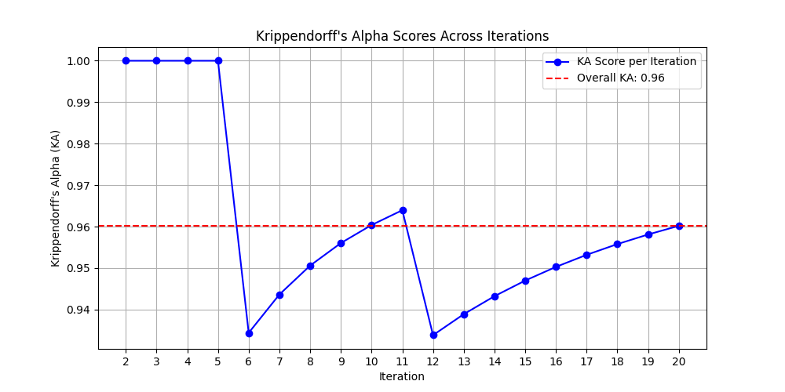

# promptstability
Repo for paper analyzing stability of outcomes resulting from variations in language model prompt specification.

## Setup

To ensure all dependencies are installed, you can follow these steps:

1. Clone the repository:

```bash
   git clone <repository-url>
``` 

2. `cd` to the repository then run the setup script:

```bash
   cd <repository-directory>
   pip install -r requirements.txt
```

## Usage

### Baseline stochasticity

```python
import os
import pandas as pd
from utils import LLMWrapper
from utils import PromptStabilityAnalysis
from utils import get_openai_api_key
from transformers import AutoModelForCausalLM, AutoTokenizer
import simpledorff
import seaborn as sns
import matplotlib.pyplot as plt

## Usage example
APIKEY = get_openai_api_key()
MODEL = 'gpt-3.5-turbo'

# Data
df = pd.read_csv('data/tweets.csv')
df = df.sample(10)
example_data = list(df['text'].values)

llm = LLMWrapper(apikey=APIKEY, model=MODEL)
psa = PromptStabilityAnalysis(llm=llm, data=example_data)

# Step 2: Construct the Prompt
original_text = 'The following is a Twitter message written either by a Republican or a Democrat before the 2020 election. Your task is to guess whether the author is Republican or Democrat.'
prompt_postfix = '[Respond 0 for Democrat, or 1 for Republican. Guess if you do not know. Respond nothing else.]'

# Run baseline_stochasticity
KA, df, ka_scores, iterrations_no = psa.baseline_stochasticity(original_text, prompt_postfix, iterations=20)

# Model
llm = LLMWrapper(model = MODEL, apikey=APIKEY)
psa = PromptStabilityAnalysis(llm, texts, parse_function=lambda x: float(x), metric_fn = simpledorff.metrics.nominal_metric)

# Prompt
prompt = 'The following is a Twitter message written either by a Republican or a Democrat before the 2020 election. Your task is to guess whether the author is Republican or Democrat.'
prompt_postfix = '[Respond 0 for Democrat, or 1 for Republican. Guess if you do not know. Respond nothing else.]'

# TODO: add this into library as function
# Function to plot KA scores with integer x-axis labels
def plot_ka_scores(ka_scores, overall_ka):
    iterations = list(range(2, 2 + len(ka_scores)))

    plt.figure(figsize=(10, 5))
    plt.plot(iterations, ka_scores, marker='o', linestyle='-', color='b', label='KA Score per Iteration')
    plt.axhline(y=overall_ka, color='r', linestyle='--', label=f'Overall KA: {overall_ka:.2f}')
    plt.xlabel('Iteration')
    plt.ylabel('Krippendorff\'s Alpha (KA)')
    plt.title('Krippendorff\'s Alpha Scores Across Iterations')
    plt.xticks(iterations)  # Set x-axis ticks to be whole integers
    plt.legend()
    plt.grid(True)
    plt.show()


# Plot the KA scores
plot_ka_scores(ka_scores, KA)

```

